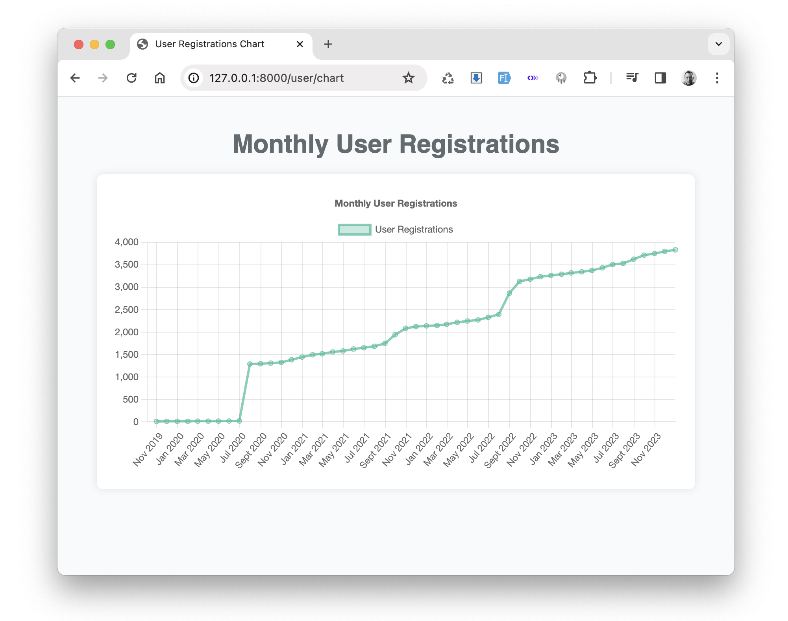
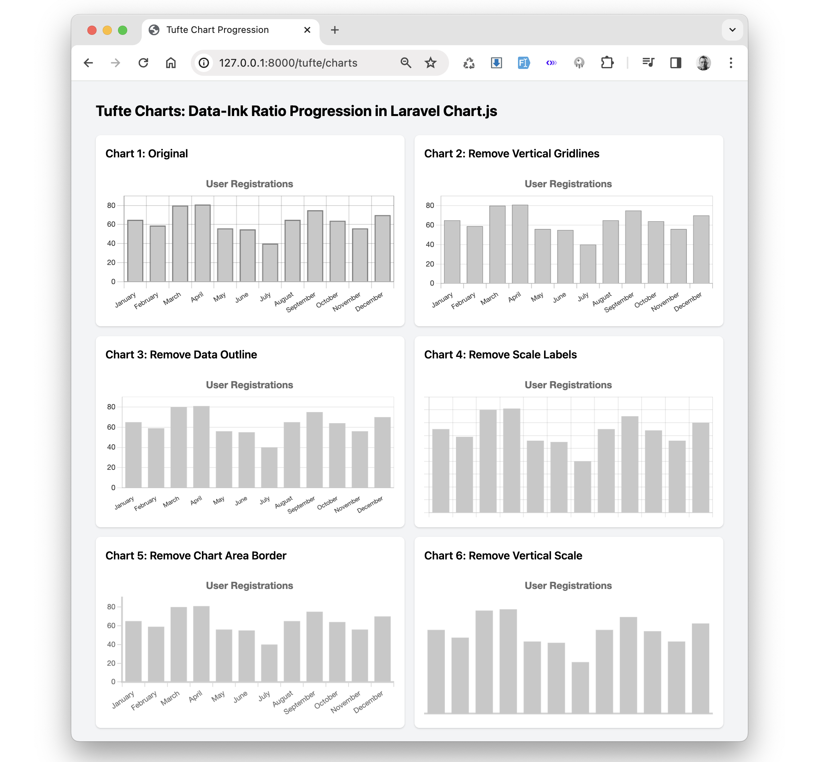

## About The Laravel Chartjs Package Demo

This repository is dedicated to demonstrating the capabilities of the [Laravel Chartjs package](https://github.com/icehouse-ventures/laravel-chartjs), which is a powerful interface for integrating Chart.js version 4 into Laravel applications. With a focus on the latest Chart.js features, this demo provides a comprehensive look at the extensive chart options available, including new chart types, animations, and interactivity enhancements.

### Models: UserController Example

Included in this repository is a `UserController` example that illustrates how to implement user-related data visualizations using Chart.js version 4. It serves as a practical guide for developers looking to add interactive and customizable charts to their Laravel projects, with detailed examples on utilizing the advanced design and chart options provided by Chart.js.

### Chart Design: Tufte Data-Ink Ratio Examples

The repo also features Tufte chart examples, which are designed to display complex data in a clear and beautiful way, following the principles of Edward Tufte. These examples help in creating elegant and informative charts that enhance the data presentation, while also demonstrating how to apply the data-ink ratio concept using Chart.js design options to make your charts as informative as possible with minimal distractions.

## Getting Started

To get started with the Laravel Chartjs package demo, clone the repository and follow the setup instructions provided in the [Laravel Chart.js User Guide](https://icehouse-ventures.github.io/laravel-chartjs/). Explore the various chart examples to learn how to integrate and customize charts in your own Laravel applications.

You can run the app using php artisan serve. In which case the demo pages will be available at:

/legacy
/user/chart
/tufte/charts
/stephenfew/charts

## Contributions

Contributions are welcome! If you have any improvements or additional examples, please feel free to submit a pull request.

## License

This demo is open-sourced software licensed under the [MIT license](https://opensource.org/licenses/MIT).
